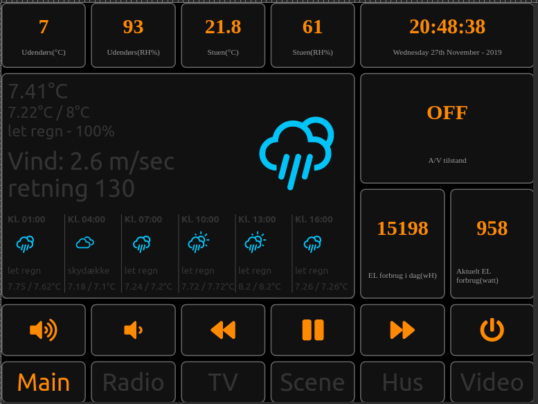
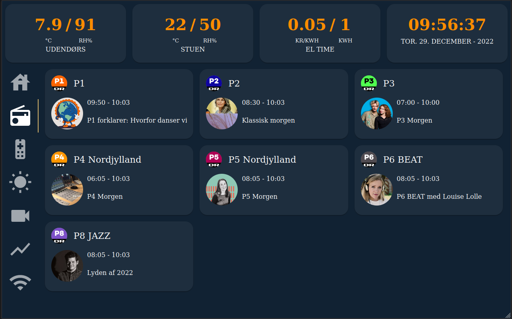

React dashboard
===

Work in progress, and react playground. This is my attempt at creating an interface for my home automation setup, targeted at tablets.

the plan is to use an old tablet, mounted in a frame on the wall as interface for controlling various things in the house. Including chromecast audio / video streams.

This _may_ work for you (most probably it won't). But I have put it out there in order for demonstrational purpose. Some implementations might even be wrong! You have been warned!

This project was bootstrapped with [Create React App](https://github.com/facebook/create-react-app).

